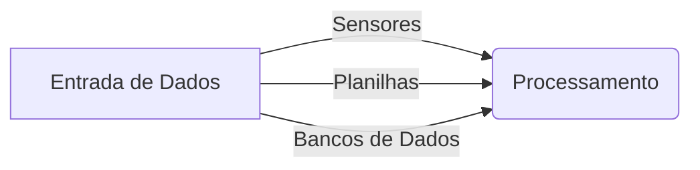
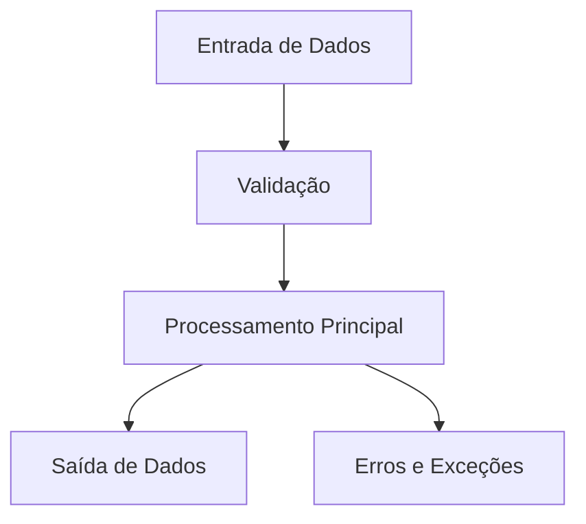
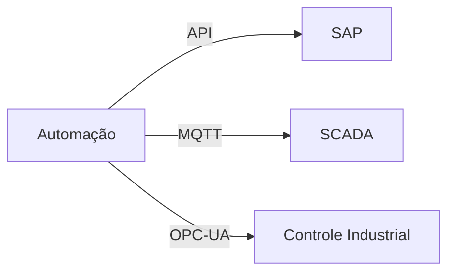

# Levantamento de Requisitos para Automação de Processos Industriais

## 📌 Introdução
Este documento serve como um guia para levantar e documentar requisitos para automação de processos industriais. Ele combina métodos modernos para maximizar a eficiência e garantir um levantamento de requisitos bem estruturado e validado continuamente.

## 🏗 Estrutura do Documento

1. [Informações Gerais](#informações-gerais)
2. [Objetivo da Automação](#objetivo-da-automação)
3. [Escopo do Script](#escopo-do-script)
4. [Usuários do Script](#usuários-do-script)
5. [Entrada de Dados](#entrada-de-dados)
6. [Processamento e Lógica](#processamento-e-lógica)
7. [Saída de Dados](#saída-de-dados)
8. [Integração com Outros Sistemas](#integração-com-outros-sistemas)
9. [Segurança e Compliance](#segurança-e-compliance)
10. [Testes e Validação](#testes-e-validação)
11. [Manutenção e Suporte](#manutenção-e-suporte)
12. [Como Clonar e Utilizar os Arquivos](#como-clonar-e-utilizar-os-arquivos)

## 📄 1. Informações Gerais
| Campo | Descrição |
|--------|------------|
| **Nome do Projeto** | Nome do projeto de automação |
| **Responsável** | Quem está conduzindo o levantamento |
| **Data** | Data do levantamento |
| **Versão** | Número da versão do documento |
| **Departamento** | Área responsável pelo processo |
| **Stakeholders** | Partes interessadas |

## 🎯 2. Objetivo da Automação
- **Descrição do Processo Atual:** Como o processo é feito hoje.
- **Problemas Identificados:** Erros, gargalos e ineficiências.
- **Benefícios Esperados:** Redução de custos, melhoria de qualidade, etc.
- **KPIs para Medição do Sucesso:** Indicadores de performance antes e depois da automação.

## 📌 3. Escopo do Script
- **Processos Incluídos:** O que será automatizado.
- **Processos Excluídos:** O que não será automatizado.
- **Restrições e Limitações:** Restrições técnicas ou operacionais.

## 👥 4. Usuários do Script
- **Perfis de Usuários:** Quem usará a automação.
- **Níveis de Acesso:** Quem pode executar, editar e visualizar dados.
- **Interface do Usuário:** Como o usuário interage com o script.
- **Treinamento e Documentação:** Necessidade de capacitação.

## 📥 5. Entrada de Dados
- **Fontes de Dados:** Sensores, sistemas, bancos de dados.
- **Formato dos Dados:** CSV, JSON, XML, etc.
- **Frequência de Entrada:** Tempo real, lotes periódicos.
- **Validação e Tratamento de Erros:** Como lidar com entradas inválidas.



## 🔄 6. Processamento e Lógica
- **Regras de Negócio:** Algoritmos e cálculos envolvidos.
- **Tratamento de Exceções:** O que acontece em caso de erro.
- **Aprendizado de Máquina:** Se necessário, otimização do processo.



## 📤 7. Saída de Dados
- **Formatos de Saída:** Relatórios, dashboards, arquivos.
- **Destino dos Dados:** Banco de dados, APIs, notificações.
- **Frequência da Saída:** Tempo real ou processamento em lote.

## 🔗 8. Integração com Outros Sistemas
- **Sistemas a Serem Integrados:** SAP, MES, SCADA, etc.
- **Protocolos e APIs:** REST, MQTT, OPC-UA.
- **Requisitos de Comunicação:** Tempo de resposta, segurança.



## 🔒 9. Segurança e Compliance
- **Autenticação e Autorização:** Quem pode acessar e modificar.
- **Registro de Atividades:** Logs de execução.
- **Normas e Regulamentações:** LGPD, ISO 27001.
- **Criptografia e Proteção de Dados:** Como os dados são protegidos.

## ✅ 10. Testes e Validação
- **Critérios de Aceitação:** O que precisa estar funcionando para aprovação.
- **Testes Unitários e de Integração:** Como garantir que tudo funciona corretamente.
- **Ambiente de Testes:** Servidores de homologação, dados de teste.

## 🛠 11. Manutenção e Suporte
- **Responsável pela Manutenção:** Quem fará ajustes e correções.
- **Frequência de Atualizações:** Como serão aplicadas melhorias.
- **Procedimentos de Suporte:** Como os usuários podem relatar problemas.

## 🔽 12. Como Clonar e Utilizar os Arquivos

### 🔹 Clonar o Repositório Git
Execute o seguinte comando no terminal para clonar o repositório:

```bash
git clone https://github.com/seu-usuario/seu-repositorio.git
cd seu-repositorio
```

### 🔹 Compilar Arquivos LaTeX
Os arquivos LaTeX podem ser compilados usando `pdflatex` ou ferramentas como Overleaf. Se estiver utilizando um terminal Linux ou Windows com MiKTeX/TeX Live instalado, use:

```bash
pdflatex nome_do_arquivo.tex
```

Caso esteja usando o Overleaf, basta fazer o upload dos arquivos `.tex` e compilar diretamente na plataforma.

---
## 🚀 Metodologia Moderna para Levantamento de Requisitos

### 🔹 1. Métodos Ágeis e Colaborativos
- Utilizar **workshops** e **entrevistas** para identificar necessidades.
- Adotar **user stories** para simplificar o entendimento dos requisitos.

### 🔹 2. Uso de Ferramentas Visuais
- Criar **diagramas BPMN** para mapear processos atuais e futuros.
- Ferramentas como **Miro, Lucidchart e Visio** ajudam na colaboração.

### 🔹 3. Documentação Dinâmica
- Preferir **Google Docs, Notion ou Confluence** para manter versões atualizadas.
- Evitar arquivos estáticos e PDFs que ficam desatualizados rapidamente.

### 🔹 4. Priorização e Validação Contínua
- Utilizar **Matriz MoSCoW** para priorizar requisitos.
- Criar **prototipagem rápida** e **testes de conceito (PoC)** antes da implementação final.

---
## 🏁 Conclusão
Este modelo fornece uma abordagem estruturada e moderna para levantamento de requisitos de automação. Ele pode ser adaptado conforme necessário para atender às necessidades específicas de cada projeto. 🚀

Se precisar de ajustes ou melhorias, contribua! 🛠
